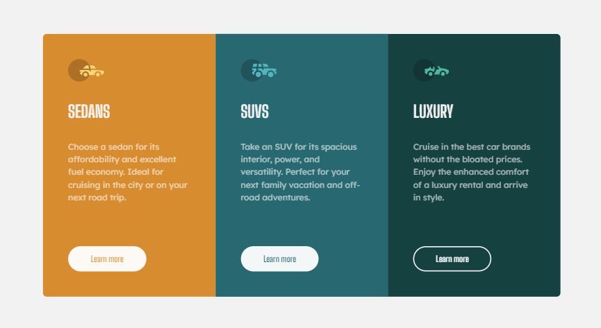

<h1 align="center">3-column preview card component</h1>

<h3>
    <a href="https://kuraanal.github.io/my.frontend.mentor.solutions/3-column%20preview%20card%20component/">
      Live
    </a>
     | 
    <a href="https://www.frontendmentor.io/solutions/3column-card-with-flex-X_7ruie20P">
      Solution
    </a>
    | 
    <a href="https://www.frontendmentor.io/challenges/3column-preview-card-component-pH92eAR2-">
      Challenge
    </a>
  </h3>

   Solution for a challenge from  <a href="https://www.frontendmentor.io/" target="_blank">frontendmentor.io</a>.

***
# The challenge

This challenge is perfect if you're just getting started. The shift between the layouts will be a nice test if you're new to building responsive projects.

The challenge is to build out this 3-column preview card component and get it looking as close to the design as possible.

#### The users should be able to:

  - View the optimal layout depending on their device's screen size
  - See hover and focus states for interactive elements

#### Built with

- HTML 5 / CSS
- Flex
- Mobile-first
- BEM

#### Links

[Mobile Screenshot](./Screenshots/Mobile.png) | [Desktop Screenshot](./Screenshots/Desktop.png)

#### What I learned

Not much, but it's getting faster.

#### Useful resources

- [Kevin Powell CSS - Youtube Channel](https://www.youtube.com/kepowob) - This helped me a lot understanding grid, flex and many other CSS particularities.

***

## Author

- Frontend Mentor - [@Kuraanal](https://www.frontendmentor.io/profile/Kuraanal)

