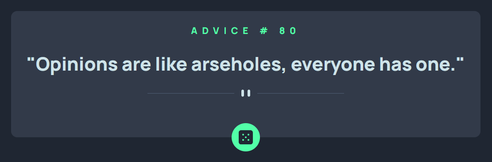

<h1 align="center">Advice Generator App</h1>

<h3>
    <a href="https://kuraanal.github.io/my.frontend.mentor.solutions/Advice%20Generator%20App/">
      Live
    </a>
     | 
    <a href="#">
      Solution
    </a>
    | 
    <a href="https://www.frontendmentor.io/challenges/advice-generator-app-QdUG-13db">
      Challenge
    </a>
  </h3>

   Solution for a challenge from  <a href="https://www.frontendmentor.io/" target="_blank">frontendmentor.io</a>.

***
# The challenge

The purpose of this challenge is to build an interactive advice generator app that fetches random advice from an API and displays it to the user, helping you practice working with APIs, responsive design, and interactive UI elements.

#### The users should be able to:

- View the optimal layout for the app depending on their device's screen size
- See hover states for all interactive elements on the page
- Generate a new piece of advice by clicking the dice icon

#### Built with

- HTML CSS JS API
- Vanilla JS
- Fetch API

#### Links

[Mobile Screenshot](./Screenshots/Mobile.png) | [Desktop Screenshot](./Screenshots/Desktop.png)

#### What I learned

Through this challenge, I learned how to work with APIs to fetch and display dynamic data, manage state in a simple JavaScript application, and implement responsive layouts using CSS. I also practiced creating interactive UI elements with hover effects and conditional styling, such as highlighting the current day's bar. Additionally, I improved my skills in structuring semantic HTML and organizing project files for clarity and maintainability.

#### Useful resources

***

## Author

- Frontend Mentor - [@Kuraanal](https://www.frontendmentor.io/profile/Kuraanal)
- Github - [Kuraanal](https://github.com/Kuraanal)