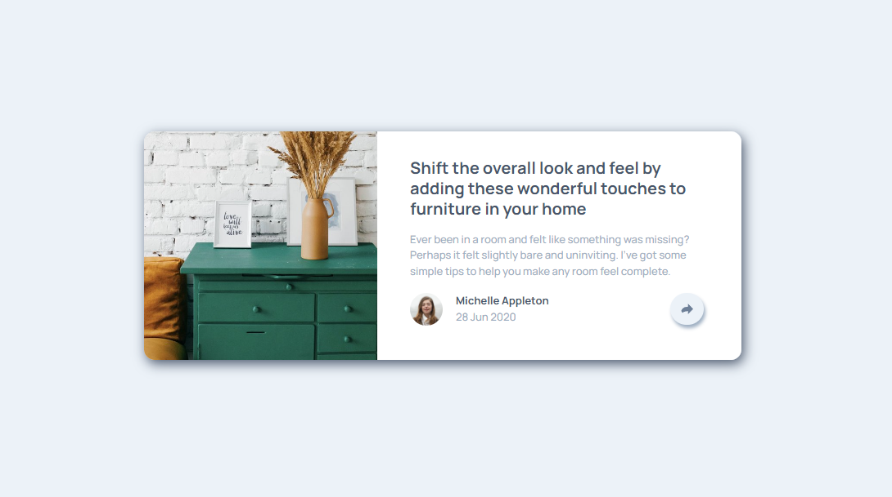

<h1 align="center">QR code component</h1>

<h3>
    <a href="https://kuraanal.github.io/my.frontend.mentor.solutions/Article%20Preview%20Component/" color="white">
      Live
    </a>
     | 
    <a href="https://www.frontendmentor.io/solutions/article-preview-with-social-media-popup-QpT-1ARPms">
      Solution
    </a>
    | 
    <a href="https://www.frontendmentor.io/challenges/article-preview-component-dYBN_pYFT">
      Challenge
    </a>
  </h3>

   Solution for a challenge from  <a href="https://www.frontendmentor.io/" target="_blank">frontendmentor.io</a>.

---

# The challenge

Your challenge is to build out this preview card component and get it looking as close to the design as possible.

#### The users should be able to:

- View the optimal layout depending on their device's screen size
- See hover states for interactive elements

#### Built with

- HTML 5 / CSS

#### Links

[Mobile Screenshot](./Screenshots/Mobile.png) | [Desktop Screenshot](./Screenshots/Desktop.png)

#### What I learned

Use of position Relative / Absolute and it's relation with overflow.

Found out that overflow hidden does hide content with position absolute.

---

## Author

- Frontend Mentor - [@Kuraanal](https://www.frontendmentor.io/profile/Kuraanal)
