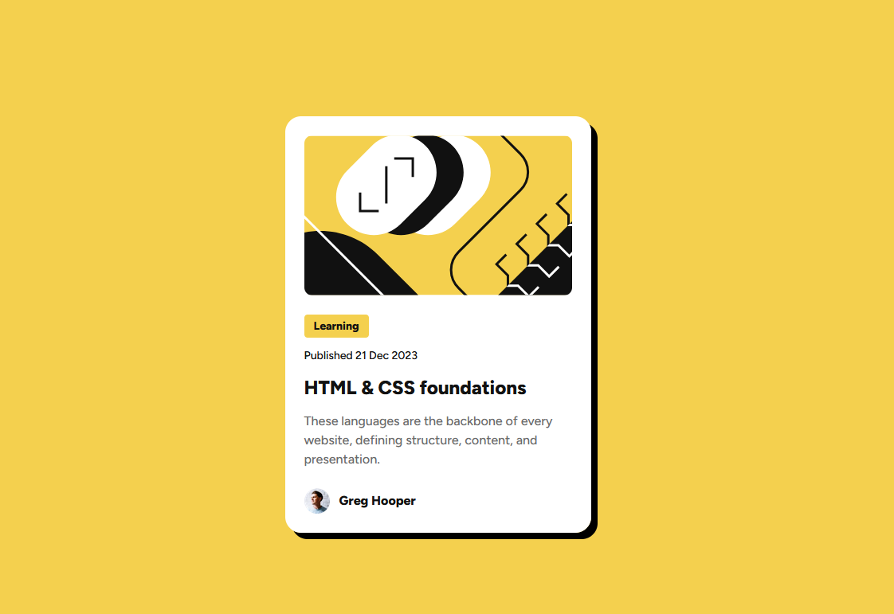

<h1 align="center">Blog Preview Card</h1>

<h3>
    <a href="https://kuraanal.github.io/my.frontend.mentor.solutions/Blog%20Preview%20Card/">
      Live
    </a>
     | 
    <a href="https://www.frontendmentor.io/solutions/responsive-card-component-joqHdeVvjC">
      Solution
    </a>
    | 
    <a href="https://www.frontendmentor.io/challenges/blog-preview-card-ckPaj01IcS">
      Challenge
    </a>
  </h3>

   Solution for a challenge from  <a href="https://www.frontendmentor.io/" target="_blank">frontendmentor.io</a>.

***
# The challenge

The purpose of this challenge is to build a responsive blog preview card component. This exercise helps improve HTML and CSS skills, focusing on layout, styling, and interactive states for UI elements.

#### The users should be able to:

- See hover and focus states for all interactive elements on the page

#### Built with

- HTML CSS
- BEM

#### Links

[Mobile Screenshot](./Screenshots/Mobile.png) | [Desktop Screenshot](./Screenshots/Desktop.png)

#### What I learned

Through this challenge, I learned how to structure semantic HTML for accessibility and apply BEM methodology for maintainable CSS. I practiced creating responsive layouts using CSS media queries and improved my understanding of flexbox for alignment and spacing. Additionally, I enhanced my skills in designing interactive states for buttons and links to ensure a better user experience.

#### Useful resources

***

## Author

- Frontend Mentor - [@Kuraanal](https://www.frontendmentor.io/profile/Kuraanal)
- Github - [Kuraanal](https://github.com/Kuraanal)