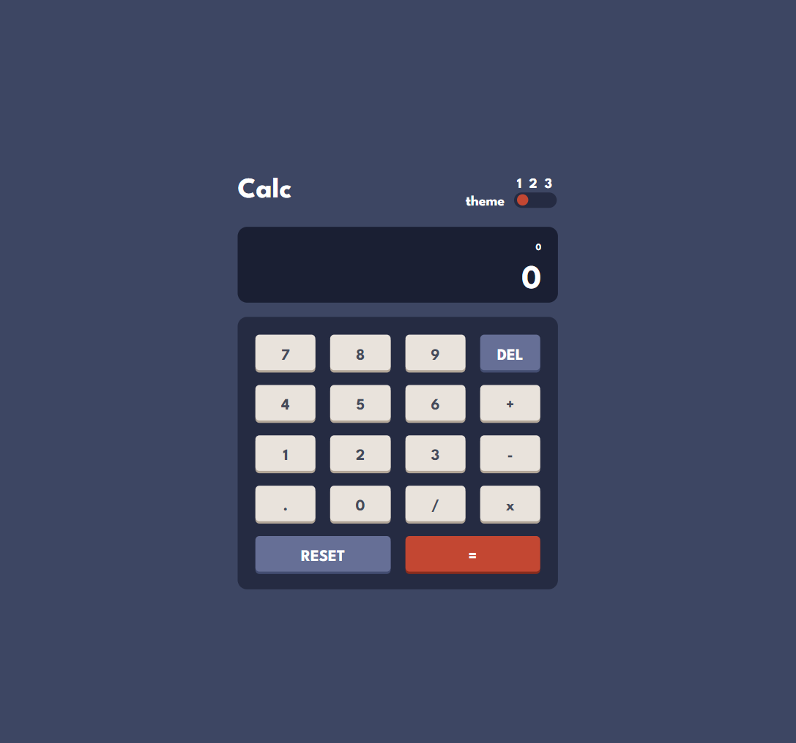

<h1 align="center">Calculator App</h1>

<h3>
    <a href="https://kuraanal.github.io/my.frontend.mentor.solutions/Calculator%20app/" color="white">
      Live
    </a>
     | 
    <a href="https://www.frontendmentor.io/solutions/calculator-app-with-data-attributes-Oo50d57x5Z">
      Solution
    </a>
    | 
    <a href="https://www.frontendmentor.io/challenges/calculator-app-9lteq5N29">
      Challenge
    </a>
  </h3>

   Solution for a challenge from  <a href="https://www.frontendmentor.io/" target="_blank">frontendmentor.io</a>.

***
# The challenge

This calculator app will be a great test of your CSS and JS skills especially.
If you're wanting to practice using Grid, this challenge will be perfect for you!

The challenge is to build out this calculator app and get it looking as close to the design as possible.

#### The users should be able to:

  - See the size of the elements adjust based on their device's screen size
  - Perform mathematical operations like addition, subtraction, multiplication, and division
  - Adjust the color theme based on their preference

#### Built with

- HTML 5 / CSS
- Flex / Grid
- Mobile-first
- BEM
- Data Attributes
- Javascript (Vanilla)

#### Links

[Mobile Screenshot](./Screenshots/Mobile.png) | [Desktop Screenshot](./Screenshots/Desktop.png)

#### What I learned

Wanted to learn how to use Data attributes so I use them a lot. Was especially fun to use it for theme selection slider.

Used a Data attribute on the body to know what theme was selected and a body[data-theme="x"] selector to override theme colors variables.

Tried to make the slider with a.... Slider (input range). And I can't wait to have native css properties to play with because it was a pain in the ass to make it nice. Would love to animate it, but still not possible.

The application side of it was not as interesting but I think I manage to make a 'OK' job.

#### Useful resources

- [Kevin Powell CSS - Youtube Channel](https://www.youtube.com/kepowob) - This helped me a lot understanding grid, flex and many other CSS particularities.

***

## Author

- Frontend Mentor - [@Kuraanal](https://www.frontendmentor.io/profile/Kuraanal)

