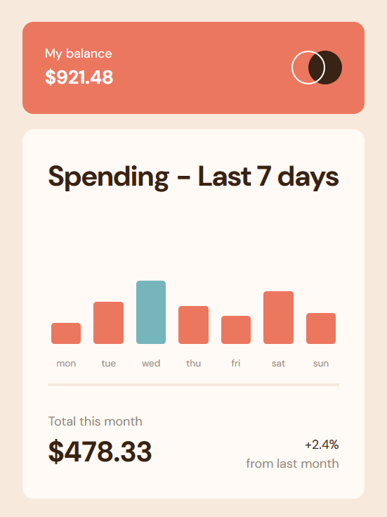

<h1 align="center">Expenses Chart Component</h1>

<h3>
    <a href="https://kuraanal.github.io/my.frontend.mentor.solutions/Expenses%20Chart%20Component/">
      Live
    </a>
     | 
    <a href="https://www.frontendmentor.io/solutions/expenses-chart-component-t6zRX8rPMN">
      Solution
    </a>
    | 
    <a href="https://www.frontendmentor.io/challenges/expenses-chart-component-e7yJBUdjwt">
      Challenge
    </a>
  </h3>

   Solution for a challenge from  <a href="https://www.frontendmentor.io/" target="_blank">frontendmentor.io</a>.

***
# The challenge

The challenge is to build out this bar chart component and get it looking as close to the design as possible.

#### The users should be able to:

- View the bar chart and hover over the individual bars to see the correct amounts for each day
- See the current day's bar highlighted in a different colour to the other bars
- View the optimal layout for the content depending on their device's screen size
- See hover states for all interactive elements on the page
- Bonus: See dynamically generated bars based on the data provided in the local JSON file

#### Built with

- HTML 5 / CSS
- Vanilla JS
- BEM

#### Links

[Mobile Screenshot](./Screenshots/Mobile.png) | [Desktop Screenshot](./Screenshots/Desktop.png)

#### What I learned

Through this project, I learned how to implement responsive layouts using CSS Grid and Flexbox, manage dynamic data rendering with JavaScript, and apply BEM methodology for maintainable CSS. I also improved my skills in creating interactive charts and handling hover states for better user experience.

#### Useful resources

***

## Author

- Frontend Mentor - [@Kuraanal](https://www.frontendmentor.io/profile/Kuraanal)
- Github - [Kuraanal](https://github.com/Kuraanal)