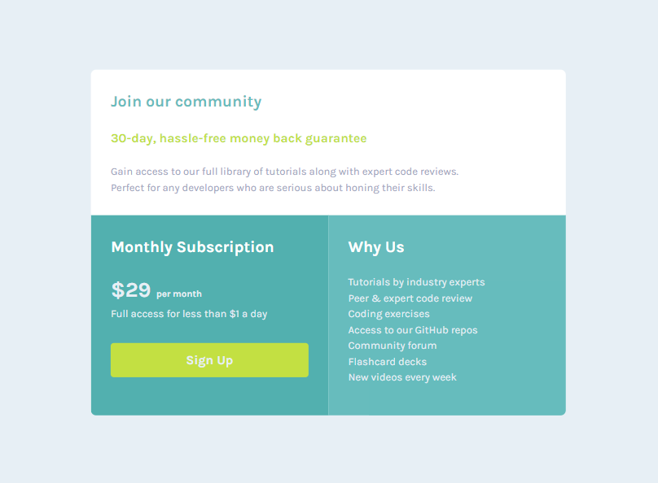

<h1 align="center">Single price grid component</h1>

<h3>
    <a href="https://kuraanal.github.io/my.frontend.mentor.solutions/Single%20price%20grid%20component/" color="white">
      Live
    </a>
     | 
    <a href="https://www.frontendmentor.io/solutions/single-price-grid-component-5ce41129d0ff452fec5abbbc">
      Solution
    </a>
    | 
    <a href="https://www.frontendmentor.io/challenges/single-price-grid-component-5ce41129d0ff452fec5abbbc">
      Challenge
    </a>
  </h3>

   Solution for a challenge from  <a href="https://www.frontendmentor.io/" target="_blank">frontendmentor.io</a>.

***
# The challenge

This challenge is to build out this pricing component and get it looking as close to the design as possible.

#### The users should be able to:

  - View the optimal layout for the component depending on their device's screen size
  - See a hover state on desktop for the Sign Up call-to-action

#### Built with

- HTML 5 / CSS
- Flex
- Mobile-first
- BEM ?

#### Links

[Mobile Screenshot](./Screenshots/Mobile.png) | [Desktop Screenshot](./Screenshots/Desktop.png)

#### What I learned

Flex only for this challenge. Force me to do more research on Flex and how to improve my skills with it.

#### Useful resources

- [Kevin Powell CSS - Youtube Channel](https://www.youtube.com/kepowob) - This helped me a lot understanding grid, flex and many other CSS particularities.

***

## Author

- Frontend Mentor - [@Kuraanal](https://www.frontendmentor.io/profile/Kuraanal)

