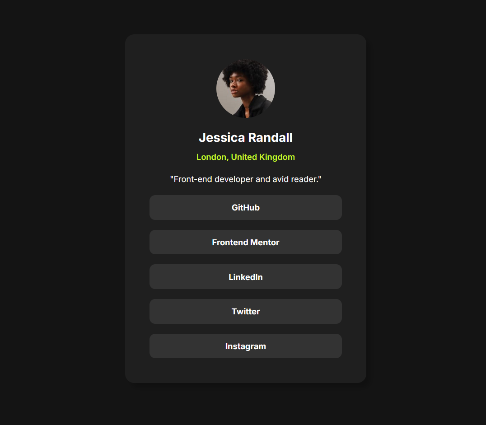

<h1 align="center">Social Links Profile</h1>

<h3>
    <a href="https://kuraanal.github.io/my.frontend.mentor.solutions/Social%20Links%20Profile/" color="white">
      Live
    </a>
     | 
    <a href="">
      Solution
    </a>
    | 
    <a href="https://www.frontendmentor.io/challenges/social-links-profile-UG32l9m6dQ">
      Challenge
    </a>
  </h3>

   Solution for a challenge from  <a href="https://www.frontendmentor.io/" target="_blank">frontendmentor.io</a>.

***
# The challenge

The goal is to practice responsive design, layout techniques, and interactive states, while following a real-world design specification provided by Frontend Mentor.

#### The users should be able to:

  - See hover and focus states for all interactive elements on the page.

#### Built with

- HTML 5 / CSS
- Flex

#### Links

[Mobile Screenshot](./Screenshots/Mobile.png) | [Desktop Screenshot](./Screenshots/Desktop.png)

#### What I learned

Not sure. This one was kind of quick

#### Useful resources

***

## Author

- Frontend Mentor - [@Kuraanal](https://www.frontendmentor.io/profile/Kuraanal)

